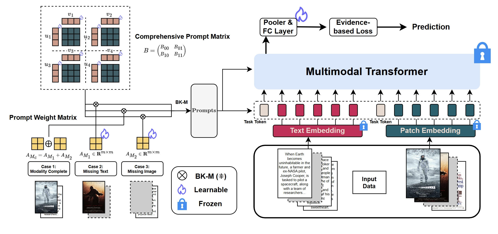

# EPE-P: Evidence-based Parameter-efficient Prompting for Multimodal Learning with Missing Modalities

## Introduction
Missing modalities are a common challenge in real-world multimodal learning scenarios, occurring during both training and testing. Existing methods for managing missing modalities often require the design of separate prompts for each modality or missing case, leading to complex designs and a substantial increase in the number of parameters to be learned. As the number of modalities grows, these methods become increasingly inefficient due to parameter redundancy. To address these issues, we propose Evidence-based Parameter-Efficient Prompting (EPE-P), a novel and parameter-efficient method for pretrained multimodal networks. Our approach introduces a streamlined design that integrates prompting information across different modalities, reducing complexity and mitigating redundant parameters. Furthermore, we propose an Evidence-based Loss function to better handle the uncertainty associated with missing modalities, improving the model’s decision-making.

  

## Usage

1. Download the datasets by the instruction `vilt/datasets/DATA.md` and preprocess them by `make_arrow.py`.
2. Download the pre-trained baseline model ViLT weights from [here](https://github.com/dandelin/ViLT.git).
3. Prepare for the environment `pip install -r requirements.txt`.
4. Run parameters are displayed in `vilt/config.py`, then run `python run.py --[parameters_chosen]`.
5. For testing, set `test_only=True` which is `False` in default for training.

# Acknowledgements
Our code is based on [missing-aware-prompts (MAP)](https://github.com/YiLunLee/missing_aware_prompts?tab=readme-ov-file) and [Evidential Deep Learning (EDL)](https://muratsensoy.github.io/uncertainty.html).

